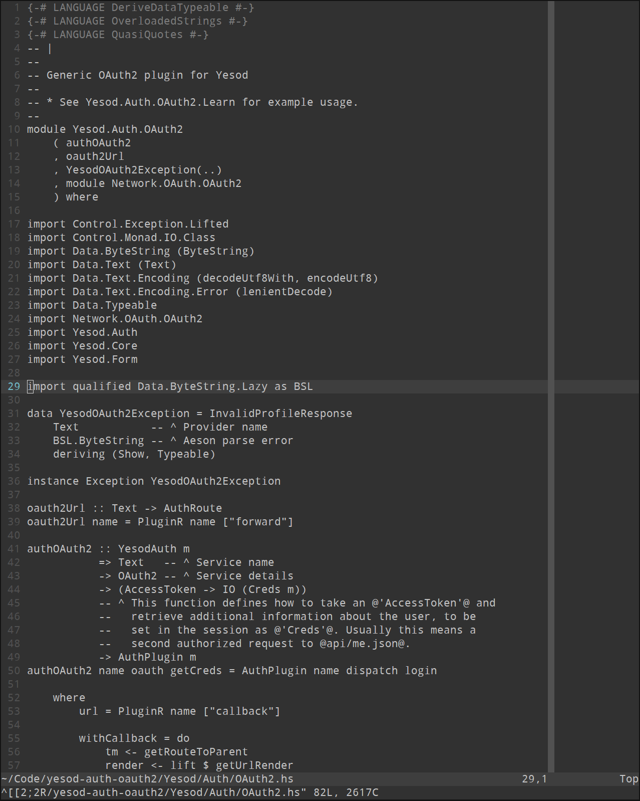

# vim-colors-off

For a number of weeks, I ran vim with `syntax off`. It was quite nice, 
with only two annoyances:

- Bright white on jet black was a bit off-putting.
- There were cases when I did miss the lack of color, vimdiff for 
  example.

Therefore, I aimed to find or create a colorscheme to solve these two 
issues.

The result is very much based on the [pencil][] colorscheme, which is 
surprising because it's a very colorful colorscheme, but:

- It uses a very sane approach to defining and setting colors
- It has nice background and foreground colors
- In the areas where I do want color, I like how it colors things

[pencil]: https://github.com/reedes/vim-colors-pencil



Slightly out of date, not super exciting...

## Installation

- Use your preferred plugin manater
- Add "pbrisbin/vim-colors-off" as a plugin

## Usage

```
:colorscheme off
```

Supports both `background=light` and `background=dark`.

## Options

- `g:colors_off_a_little`: Set to `1` to bring back _a little_ color, here and there. Default `0`.

---

[LICENSE](./LICENSE)
